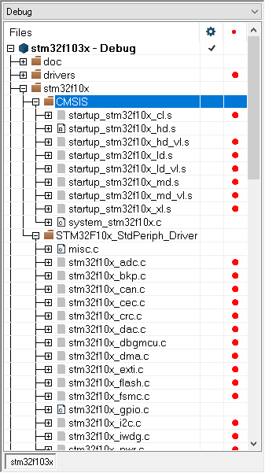
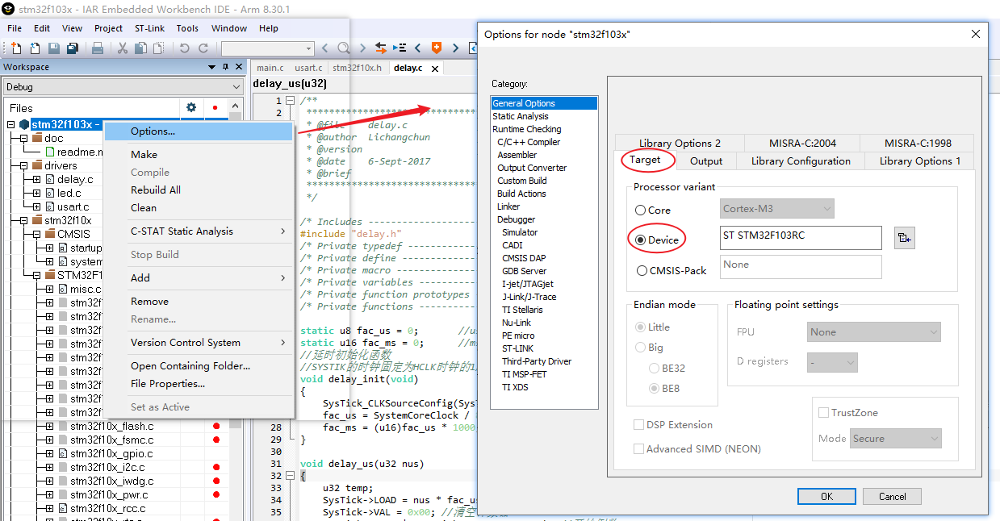
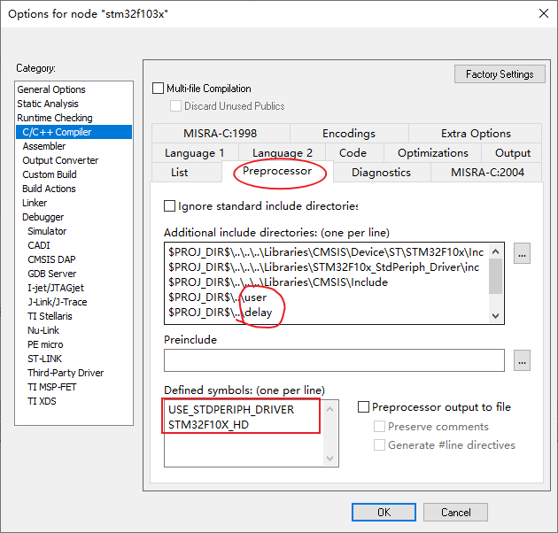
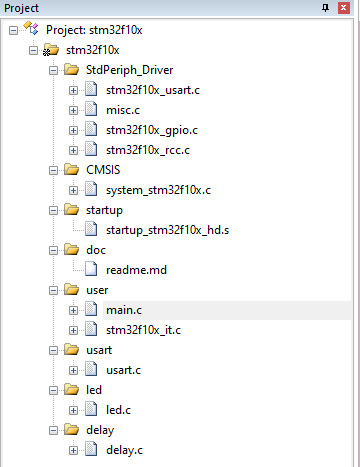
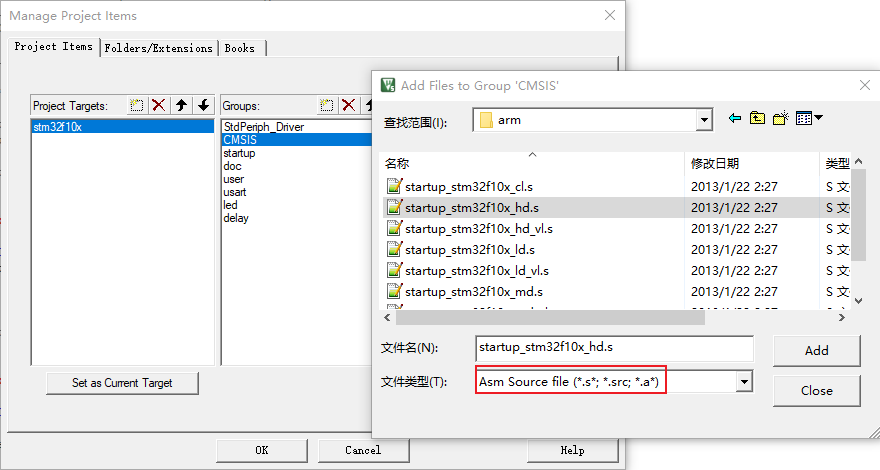
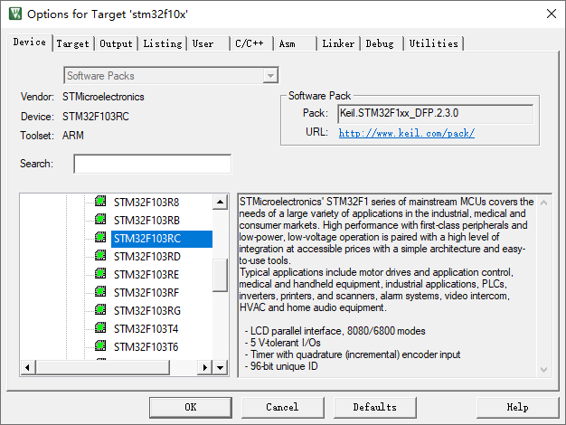
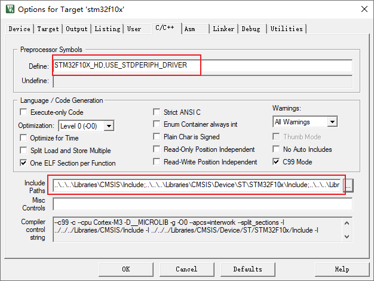
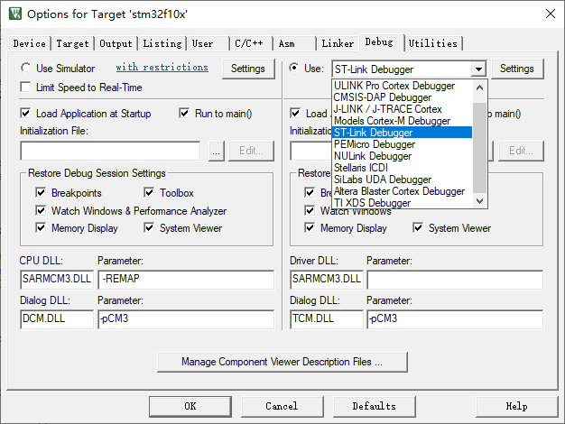

# STM32F10x 工程模板

## 目录结构

* Projects - 存放各项目文件夹
* Libraries - 这是标准外设库、开源库、启动文件等存放的地方，这些目录是可以复用的
* Examples - 备份一些常用的外设驱动源码
* Resources - 存放资源文件，如图片等

## 新建项目

将 Project 目录下的 Template 目录拷贝一份，修改拷贝的目录名为新项目名。然后根据要用的 IDE 工具不同，编辑不同的项目配置文件。以下介绍 IAR、MDK（即 KEIL） 和 SW4STM32 三种 IDE 的项目配置方式。

> [!NOTE]
> 采用上述目录结构，Libraries 目录下的标准库文件、启动文件或下载的开源库等都是可以复用的，新建项目只需从 Projects 下的模板轻量拷贝一些用户代码和项目配置。

###  IAR 项目配置

进入新项目目录的 EWARM 文件夹，里面有一个 stm32f103x.eww 文件，这是我们拷贝得到的 IAR 工作空间配置文件，而在这个工作空间中只包含了一个项目。双击打开 stm32f103x.eww 文件，进入 IAR 工作空间。由于新项目是从模板拷贝的，所以已经包含了的基本目录结构和一些源码，只需要在模板基础上按需修改、裁剪或添加。

- **选择启动文件**

  如下图所示为模板项目树的局部，其中 stm32f10x/CMSIS 目录包含了 STM32 启动和系统初始化文件。STM32 的启动文件是特定于芯片型号的一段汇编代码，即图中的 .s 文件，模板将 stm32f10x 系列的所有启动文件一起添加了进来，但我们**必须根据芯片型号选择其中一个**。查数据手册知 stm32f103rct6 这个型号属于“大容量产品”，对应 startup_stm32f10x_hd.s 这个文件，所以我们保留这个文件，将其他几个 .s 文件排除出构建目标，方法是：右键单击源文件 -> Options..，在弹出的窗口中左上角框选或取消框选“Exclude from build”。

  
  
- **裁剪外设驱动**
  
  如项目树图所示，模板将标准外设库中的所有外设驱动源码都添加到了项目树中，实际项目一般不会全用到。应当根据实际项目使用外设的情况，**保留用到的驱动，将无用的驱动排除出项目**。操作方法为同上。

新项目的选项配置也是随模板拷贝而来，可能需要对其进行一些个性化配置，可参考如下操作：

- **选择器件**

  如下图所示，右键 Workspace 窗口的项目名称，选择 Options 进入选项配置窗口。

  

- **预处理选项**

  根据新项目的需求，可能需要更改 include 搜索路径，以及全局的宏定义。同样在 Options 窗口，点击左侧 C/C++ Compiler 目录，再点击右侧的 Preprocessor 选项，如下如所示。将新项目新增头文件存放目录添加到 Additional include directories 文本框中，注意使用 $PROJ_DIR$ 打头的相对路径，方便移植。

  

  另外 Defined symbols 文本框用于添加全局的宏定义，如上图所示 USE_STDPERIPH_DRIVER 表示使用标准外设库，本模板就使用了标准外设库，此项一般不动。而另一条宏定义 STM32F10X_HD 则跟 MCU 的存储容量有关，即所谓“小容量”、“中等容量”或“大容量”，具体描述应当参考 MCU 的数据手册，宏定义可参考 stm32f10x.h 中的注释，截取如下：

  ```C
    /* #define STM32F10X_LD */     /*!< STM32F10X_LD: STM32 Low density devices */
    /* #define STM32F10X_LD_VL */  /*!< STM32F10X_LD_VL: STM32 Low density Value Line devices */  
    /* #define STM32F10X_MD */     /*!< STM32F10X_MD: STM32 Medium density devices */
    /* #define STM32F10X_MD_VL */  /*!< STM32F10X_MD_VL: STM32 Medium density Value Line devices */  
    /* #define STM32F10X_HD */     /*!< STM32F10X_HD: STM32 High density devices */
    /* #define STM32F10X_HD_VL */  /*!< STM32F10X_HD_VL: STM32 High density value line devices */  
    /* #define STM32F10X_XL */     /*!< STM32F10X_XL: STM32 XL-density devices */
    /* #define STM32F10X_CL */     /*!< STM32F10X_CL: STM32 Connectivity line devices */
  ```
  
- **选择调试工具**

  模板默认选择 ST-Link 调试工具，根据需要可能改为 J-Link 调试工具等。

### MDK 项目配置

进入新项目目录的 MDK-ARM 文件夹，里面的 stm32f10x.uvprojx 即是拷贝得到的新项目配置文件（KEIL 比 IAR 少了一层工作空间的概念）。双击打开 stm32f10x.uvprojx，开始配置项目。新项目需完成以下几项配置：

- **选择启动文件**

  如下图所示是 KEIL 显示的项目树，其中根节点是项目名 stm32f10x，该项目下有一个**目标** stm32f10x，目标下是源码分组放置的源码。其中 startup 组放置的是 STM32 启动要用到的汇编代码。启动汇编代码是跟 MCU 的型号以及 IDE 使用的**编译工具链**有关的。ST 对 STM32F10x 按**存储容量**（FLASH、RAM 大小和外设的丰富程度）划分了一系列型号，启动文件名和 STM32 型号对应如下表所示。

  

  | 描述                     | 对应的启动文件            | 宏定义       |
  | ------------------------ | ---------------------- | ----------- |
  | STM32 互联型产品         | startup_stm32f10x_cl.s    | STM32F10X_CL |
  | STM32 小容量产品   | startup_stm32f10x_ld   | STM32F10X_LD |
  | STM32 小容量超值型产品   | startup_stm32f10x_ld_vl  | STM32F10X_LD_VL|
  | STM32 中等容量产品       | startup_stm32f10x_md.s  | STM32F10X_MD |
  | STM32 中等容量超值型产品 | startup_stm32f10x_md_vl.s | STM32F10X_MD_VL |
  | STM32 大容量产品         | startup_stm32f10x_hd.s    | STM32F10X_HD |
  | STM32 大容量超值型产品 | startup_stm32f10x_hd_vl.s | STM32F10X_HD_VL |
  | STM32 超大容量产品 | startup_stm32f10x_xl.s | STM32F10X_XL |

  根据所用 MCU 型号查表得知要使用的启动文件，若其与当前项目树中添加的启动文件不同，则需要用正确的文件替换。更改项目引用文件的方法是：右键单击目标名 -> Manage Project items..，在弹出的窗口中，按目标和分组从文件系统添加相应的源文件。其中，用于 MDK 项目的启动文件存放路径为 Libraries/CMSIS/Device/ST/STM32F10x/Source/Templates/arm，注意启动文件是汇编文件，如下图所示，需要选择文件类型为 .s 才能使汇编文件可见。

  

- **配置外设驱动**

  模板使用了**标准外设库**来驱动 MCU 的片上外设，使用此库需要我们根据外设使用情况自行添加外设驱动源文件。如前面项目树图所示，模板使用的外设驱动包括：
  
  - misc.c - 包含一些和处理器核紧密相连的配置接口，如嵌套向量中断配置
  - stm32f10x_rcc.c - 用于时钟设置，外设复位和时钟管理  
  - stm32f10x_gpio.c - GPIO 驱动，用于输出高低电平驱动一些器件，如 LED，或从器件读取电平，如按键
  - stm32f10x_usart.c - 串口驱动
  
- **设置器件型号**

  右键单击项目树中的项目名 -> Options for Target 'xxx'，进入选项配置窗口，选择 Device 标签页，选中自己的 MCU 型号。如下图所示。



- **编译参数配置**

  主要是设置 C/C++ 编译参数，同样打开目标的选项配置的窗口，点击进入 C/C++ 标签页，如下图所示。首先添加两条全局的宏定义。其中一条与 MCU 型号有关，查前面的 MCU 产品列表可得，例如 STM32F10X_HD。宏 USE_STDPERIPH_DRIVER 则表示使用标准外设库，此模板基于标准外设库建立，此宏可不动。然后根据项目的目录结构，要将用到的头文件目录添加到 Include 搜索路径中，见下图第二个红框。

  

- **调试工具选择**

  用于 STM32 的常用调试器有 ST-Link 和 J-Link，模板使用的是 ST-Link。ST-Link 是 ST 官方开发的用于 STM32/STM8 的在线调试器和编程器，它的接口简单，所需接线少。选择调试器的方法是：打开选项配置窗口，点击进入 Debug 标签页，如下如所示，点击下拉框选择调试器为 ST-Link Debugger。
  
  

### SW4STM32 项目配置